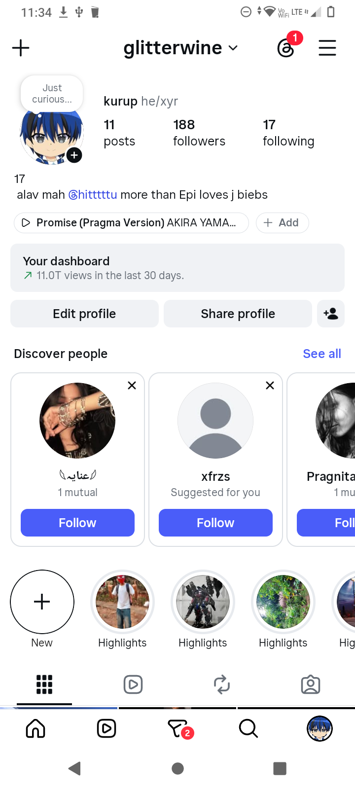

<!-- README.md -->

<div align="center">

<!-- Animated 3D COLORFUL title -->
<a href="#">
  
</a>

<br />

<!-- Hero screenshot -->


<br /><br />

<!-- COLOURED 3D TEXT (animated SVG gradient) -->


<br />

<!-- Rainbow marquee tagline -->


<br /><br />

<!-- Instagram profile with photo — one click opens IG -->
<a href="https://instagram.com/glitterwine" target="_blank">
  
</a>

<br />

<a href="https://instagram.com/glitterwine" target="_blank">
  
</a>

</div>

---

## 🍔 About @GLITTERWINE UPI BYPASSER 

xteam coder private upi BYPASSER used to bypass UPI Bank and application with 10 good token time without any issue you can bypass any UPI bank application and no need to root your phone**.

-3 MINUTE TOKEN TIME
- 🧑‍🍳 GET THE BEST
- ⭐ 4.9 average rating
- 🌱 private safe & secure 
---

## ✨ Features

| | |
|---|---|
| 🍽 **Full TUTOR** | 18+ curated dishes across 6 categories |
| 🔎 **Search & filter** | Filter by category, search by name |
| 🛒 **Persistent cart** | localStorage cart survives refresh |
| 💳 **Checkout flow** | Card / Cash / UPI with order confirmation |
| 📱 **Fully responsive** | Mobile-first, works on any device |
| 🎨 **3D doodle UI** | Chunky borders, offset shadows, animated stickers |
| ⚡ **SSR + type-safe routing** | TanStack Start + Router |

---

## 🧰 Tools & Stack

<div align="center">

<a href="https://tanstack.com/start"></a>
<a href="https://react.dev"></a>
<a href="https://www.typescriptlang.org/"></a>
<a href="https://vitejs.dev/"></a>
<a href="https://tailwindcss.com/"></a>
<a href="https://ui.shadcn.com/"></a>
<a href="https://bun.sh/"></a>
<a href="https://tanstack.com/query"></a>
<a href="https://developers.cloudflare.com/workers/"></a>
<a href="https://fonts.google.com/"></a>
<a href="https://github.com/"></a>
<a href="https://code.visualstudio.com/"></a>

</div>

---

## 🚀 Getting Started

```bash
# install deps
bun install

# start dev server
bun dev

# build for production
bun run build
```

App runs at **http://localhost:8080** in development.

---

## 📁 Project Structure

```text
src/
├── components/         # Header, Footer, MenuCard
├── lib/                # menu-data, cart-store
├── routes/             # File-based routing (TanStack Router)
│   ├── __root.tsx      # Root layout
│   ├── index.tsx       # Home / landing
│   ├── menu.tsx        # Full menu + filters
│   ├── cart.tsx        # Shopping cart
│   ├── checkout.tsx    # Checkout flow
│   └── about.tsx       # About page
├── styles.css          # Tailwind v4 + design tokens + 3D doodle utilities
└── router.tsx          # Router config
```

---

## 🎨 Design System

Custom design tokens in `src/styles.css`:

- **Palette**: `--berry` `--tomato` `--mango` `--mint` `--grape` `--sky` `--cream` `--ink`
- **3D effects**: `shadow-doodle` `shadow-doodle-lg` `shadow-doodle-xl` `press`
- **Animations**: `animate-float` `animate-wobble` `animate-pop-in` `animate-marquee` `animate-rainbow`
- **Fonts**: `Bagel Fat One` (display) · `Fredoka` (body)

---

<div align="center">


**Made with 🧡 by [@glitterwine](https://instagram.com/glitterwine)**

<a href="https://instagram.com/glitterwine">
  
</a>

</div>
